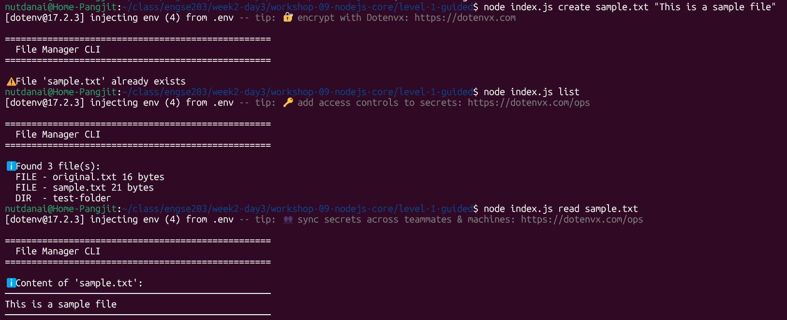
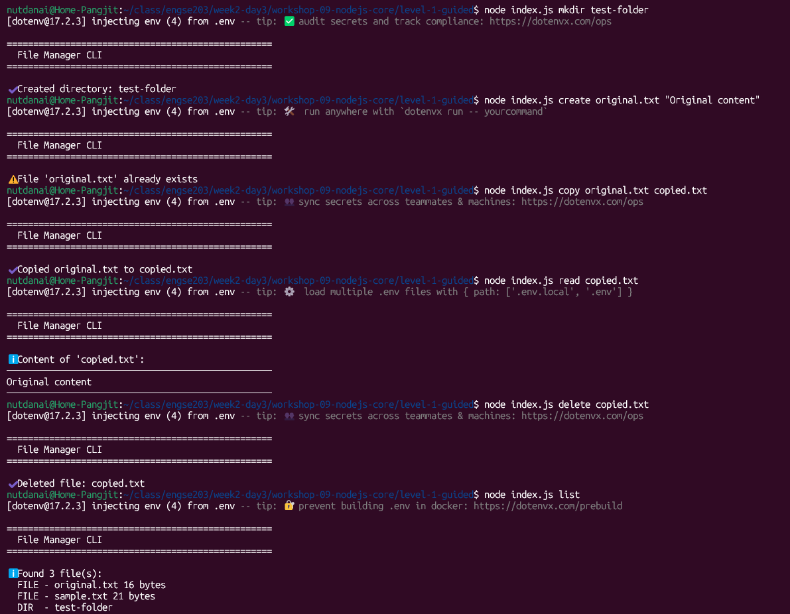
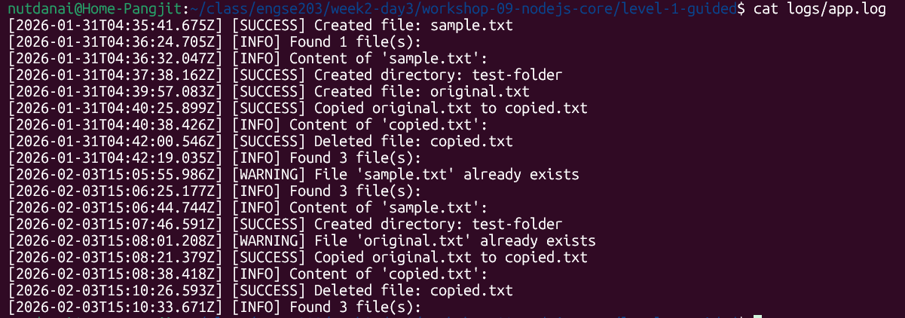
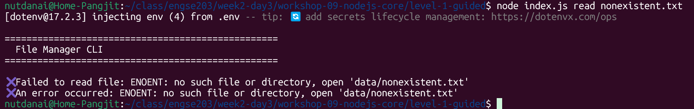
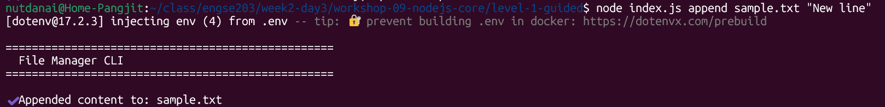
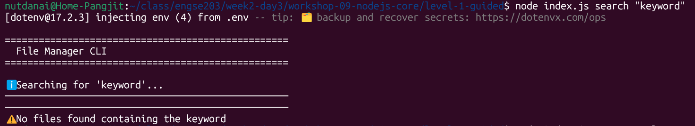
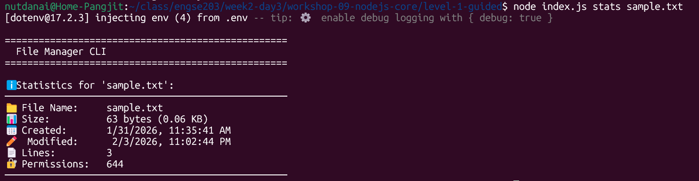

# 📊 บันทึกผลการทดลอง - Workshop 9 Level 1

## ผู้ทดลอง
- ชื่อ: นาย ณัฐดนัย แปงจิตต์
- รหัสนักศึกษา : 68543210082-2
- Email : nutdanai@live.rmutl.ac.th
- วันที่: 31/01/2569

## การทดลองที่ 1: ทดสอบคำสั่งพื้นฐาน

### คำสั่งที่ใช้:
```bash
node index.js create test1.txt "Hello Node.js"
node index.js list
node index.js read test1.txt
node index.js read nonexistent.txt
node index.js create sample.txt "This is a sample file"
node index.js list
node index.js read sample.txt
node index.js mkdir test-folder
node index.js create original.txt "Original content"
node index.js copy original.txt copied.txt
node index.js read copied.txt
node index.js delete copied.txt
node index.js list
cat logs/app.log
```

## ผลลัพธ์: Screenshots

### สร้างไฟล์ตัวอย่าง


### ทดสอบคำสั่งต่างๆ


### ตรวจสอบ logs


## การทดลองที่ 2: ทดสอบ Error Handling

### คำสั่งที่ใช้:
```bash
node index.js read nonexistent.txt
```
## ผลลัพธ์: Screenshots


## สรุป
📚 สิ่งที่ได้เรียนรู้
✅ Node.js runtime และการทำงาน
✅ การใช้ NPM และจัดการ dependencies
✅ Module system (CommonJS)
✅ File System operations (async)
✅ Environment Variables (.env)
✅ Command Line Arguments
✅ Error Handling
✅ Logging

## Challenge: เพิ่มฟีเจอร์
- Challenge 1: เพิ่มคำสั่ง append เพิ่มข้อความต่อท้ายไฟล์ที่มีอยู่
```bash
node index.js append sample.txt "New line"
```


## Challenge 2: เพิ่มคำสั่ง search
- ค้นหาไฟล์ที่มีข้อความที่ต้องการ
```bash
node index.js search "keyword"
```


## Challenge 3: เพิ่มคำสั่ง stats
- แสดงข้อมูลรายละเอียดของไฟล์
```bash
node index.js stats sample.txt
```
