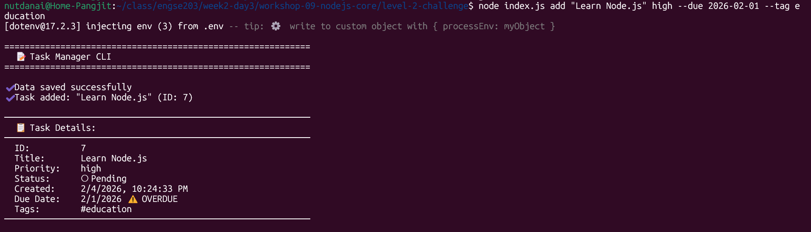
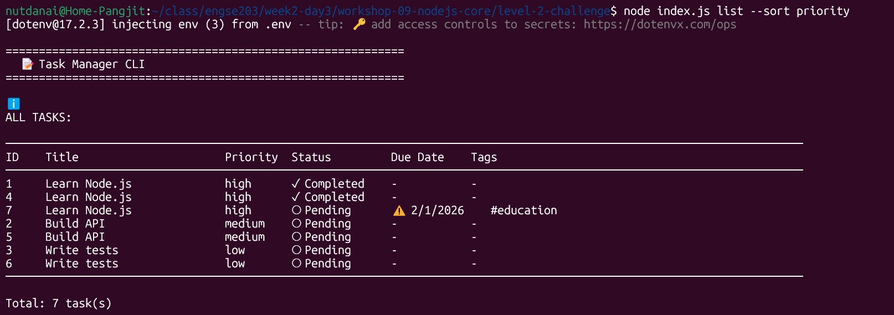
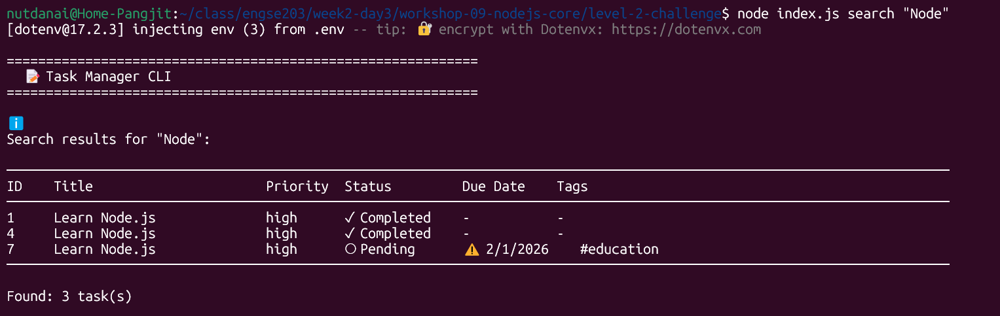
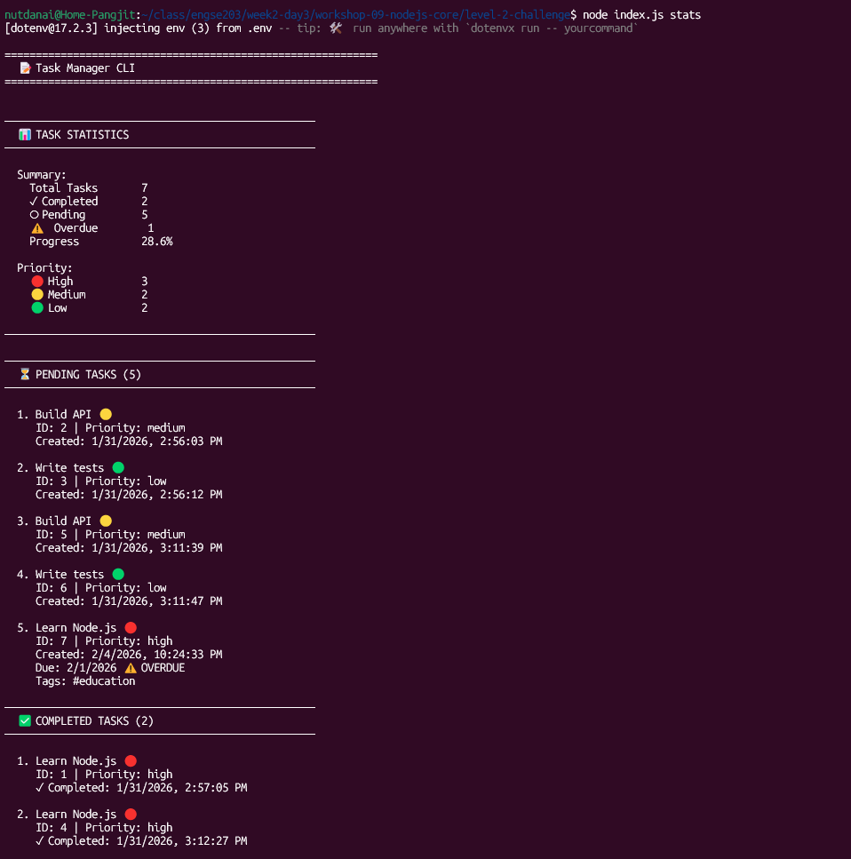
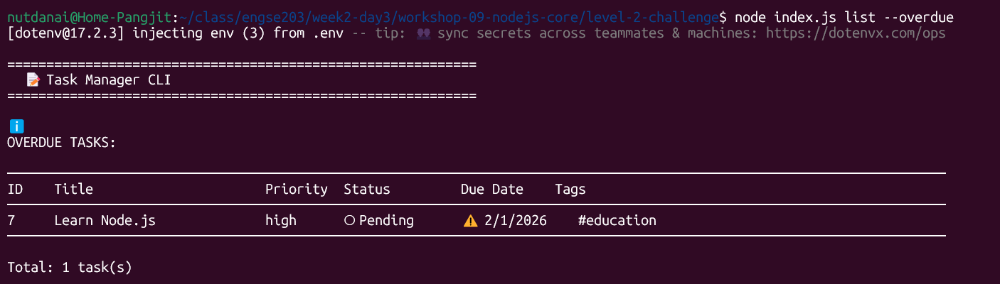

# 📊 บันทึกการพัฒนา Task Manager CLI

## ผู้พัฒนา
- ชื่อ: นาย ณัฐดนัย แปงจิตต์
- รหัสนักศึกษา : 68543210082-2
- Email : nutdanai@live.rmutl.ac.th
- วันที่: January 31, 2026

## แนวทางการพัฒนา

### 1. storage.js
**ปัญหาที่พบ:**
- ต้องตรวจสอบว่าไฟล์มีอยู่หรือไม่ก่อนอ่านข้อมูล
- ต้องสร้างโฟลเดอร์ก่อนเขียนไฟล์ถ้ายังไม่มี
- ต้องจัดการกับ JSON parsing และ formatting

**วิธีแก้:**
- ใช้ `fs.access()` เพื่อตรวจสอบว่าไฟล์มีอยู่ ถ้าไม่มีให้ return empty array
- ใช้ `fs.mkdir()` พร้อม `{ recursive: true }` เพื่อสร้างโฟลเดอร์ทั้งหมดในเส้นทาง
- ใช้ `JSON.parse()` สำหรับอ่าน และ `JSON.stringify(data, null, 2)` สำหรับเขียนแบบ pretty print
- ใช้ `path.dirname()` เพื่อหาชื่อโฟลเดอร์จาก path ของไฟล์

**สิ่งที่ได้เรียนรู้:**
- การใช้ Node.js File System (fs) แบบ async/await
- การจัดการ error handling ด้วย try-catch
- การทำงานกับ JSON files
- การสร้างโฟลเดอร์แบบ recursive

### 2. taskManager.js
**ปัญหาที่พบ:**
- ต้องจัดการ ID ให้ unique และไม่ซ้ำ
- ต้องกรองและเรียงลำดับข้อมูลตามเงื่อนไขต่างๆ
- ต้อง validate input data (เช่น priority ที่ถูกต้อง)
- ต้องจัดการกับการ import/export ที่มี ID ซ้ำกัน
- ต้องคำนวณและแสดง statistics แบบต่างๆ

**วิธีแก้:**
- ใช้ `Math.max()` หา ID สูงสุดเมื่อโหลดข้อมูล แล้วเริ่มนับต่อจากนั้น
- ใช้ `Array.filter()` สำหรับกรองข้อมูล และ `Array.sort()` สำหรับเรียงลำดับ
- สร้าง validation สำหรับ priority ให้มีแค่ low, medium, high
- เมื่อ import ให้ reassign ID ใหม่ทั้งหมดเพื่อไม่ให้ซ้ำ
- ใช้ `Array.filter()` และ `Array.reduce()` คำนวณ statistics

**สิ่งที่ได้เรียนรู้:**
- การใช้ Array methods (filter, map, find, sort, forEach)
- การทำงานกับ Date objects ใน JavaScript
- การสร้าง class และ methods ใน Node.js
- การจัดการ async operations
- การแสดงผลแบบตารางใน Terminal

## ผลการทดสอบ

### Test Case 1: CRUD Operations
- ✅ เพิ่ม task - สามารถเพิ่ม task ใหม่พร้อม priority ได้
- ✅ แสดง tasks - แสดงรายการ tasks แบบตารางสวยงาม
- ✅ แก้ไข task - แก้ไข title ของ task ได้
- ✅ ลบ task - ลบ task ตาม ID ได้

### Test Case 2: Advanced Features
- ✅ กรอง tasks - กรองแบบ all/pending/completed ได้
- ✅ Complete task - ทำเครื่องหมายเสร็จได้พร้อม timestamp
- ✅ Statistics - แสดงสถิติครบถ้วนทั้งจำนวนและแยกตาม priority
- ✅ Export/Import - export และ import ไฟล์ JSON ได้

### Test Case 3: Bonus Features
- ✅ Search - ค้นหา tasks จาก keyword ใน title หรือ tags
- ✅ Sort - เรียงลำดับตาม priority, date, หรือ due date
- ✅ Due Date - เพิ่ม due date ให้ task และแสดง overdue tasks
- ✅ Tags - เพิ่ม tags ให้ task และกรองตาม tag

## Features เพิ่มเติม (Bonus)

### 1. Search Command
- ค้นหา tasks จาก keyword ที่ตรงกับ title หรือ tags
- แสดงผลเป็นตารางเหมือน list command
```bash
node index.js search "Node"
```

### 2. Sort Feature
- เรียงลำดับตาม priority (high → medium → low)
- เรียงลำดับตาม date (ใหม่สุด → เก่าสุด)
- เรียงลำดับตาม due date (ใกล้ที่สุด → ไกลที่สุด)
```bash
node index.js list --sort priority
node index.js list --sort date
node index.js list --sort due
```

### 3. Due Date Feature
- เพิ่ม due date เมื่อสร้าง task
- แสดงเครื่องหมาย ⚠️ สำหรับ tasks ที่เลยกำหนด
- กรอง tasks ที่ overdue เท่านั้น
```bash
node index.js add "Meeting" high --due 2026-02-15
node index.js list --overdue
```

### 4. Tags/Categories Feature
- เพิ่ม tags ให้ task (สามารถมีหลาย tags)
- กรอง tasks ตาม tag ที่ระบุ
- ค้นหาจาก tags ได้ด้วย search command
```bash
node index.js add "Code review" medium --tag work
node index.js list --tag work
```

## สรุป

### สิ่งที่ได้เรียนรู้จากการทำ workshop นี้:

1. **Node.js Core Modules**
   - File System (fs.promises) สำหรับจัดการไฟล์
   - Path module สำหรับจัดการ path
   - การใช้ environment variables ด้วย dotenv

2. **JavaScript/ES6+**
   - Async/await patterns
   - Array methods (filter, map, sort, find, forEach)
   - Object destructuring
   - Template literals
   - Arrow functions
   - Date objects

3. **Software Design**
   - Module pattern และการแยก concerns
   - Class-based architecture
   - Error handling best practices
   - Data validation
   - CLI design patterns

4. **Best Practices**
   - Code organization และ modularity
   - Consistent naming conventions
   - Comments และ documentation
   - User-friendly error messages
   - Input validation

5. **Problem Solving**
   - การจัดการกับ async operations
   - การป้องกัน ID ซ้ำเมื่อ import data
   - การจัดรูปแบบข้อมูลให้แสดงผลสวยงาม
   - การออกแบบ CLI interface ที่ใช้งานง่าย

### Challenges ที่เจอ:
- การจัดการ ID ให้ unique เมื่อมีการ import/export
- การแสดงผลตารางให้สวยงามและอ่านง่าย
- การ parse command line arguments ที่มี options
- การคำนวณ overdue tasks จาก due date

### สิ่งที่สามารถพัฒนาต่อ:
- เพิ่ม recurring tasks (tasks ที่ซ้ำตามกำหนด)
- เพิ่ม reminder/notification system
- สร้าง web interface
- เพิ่ม user authentication
- เพิ่ม subtasks feature
- เพิ่ม task priorities มากกว่า 3 ระดับ
- Export เป็นรูปแบบอื่นๆ เช่น CSV, Excel

## Screenshots

### 1. Adding a Task
```
node index.js add "Learn Node.js" high --due 2026-02-01 --tag education
```
แสดง task details หลังเพิ่มสำเร็จ พร้อม ID, title, priority, due date, และ tags


### 2. Listing Tasks
```
node index.js list --sort priority
```
แสดงตารางที่มี columns: ID, Title, Priority, Status, Due Date, Tags


### 3. Search Tasks
```
node index.js search "Node"
```
แสดงเฉพาะ tasks ที่มี keyword "Node" ใน title หรือ tags


### 4. Statistics
```
node index.js stats
```
แสดงสถิติโดยรวมและรายละเอียดแต่ละ task


### 5. Overdue Tasks
```
node index.js list --overdue
```
แสดงเฉพาะ tasks ที่เลยกำหนดพร้อมเครื่องหมาย ⚠️

